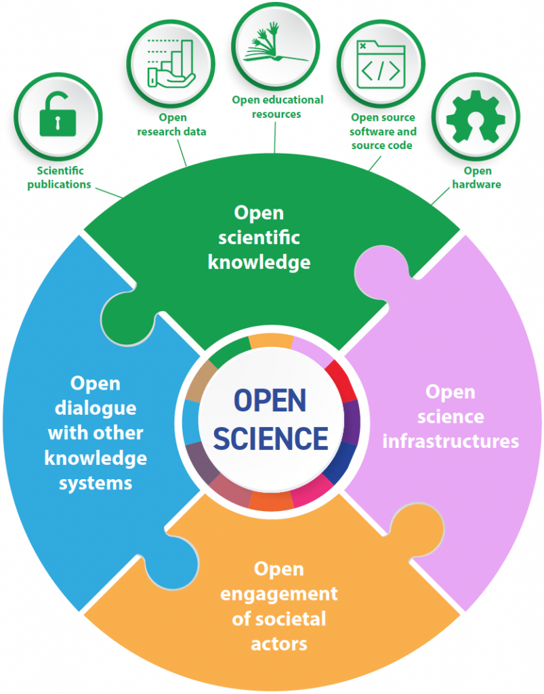
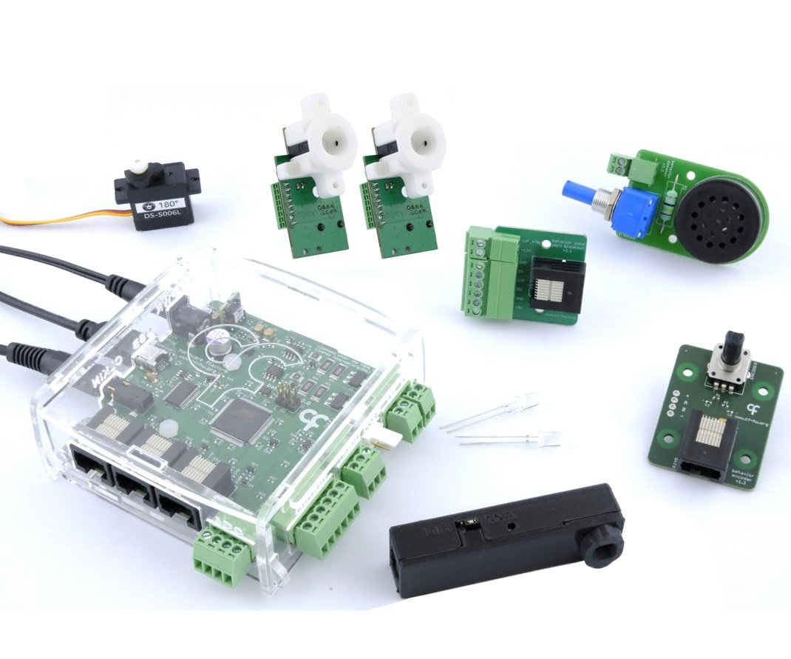
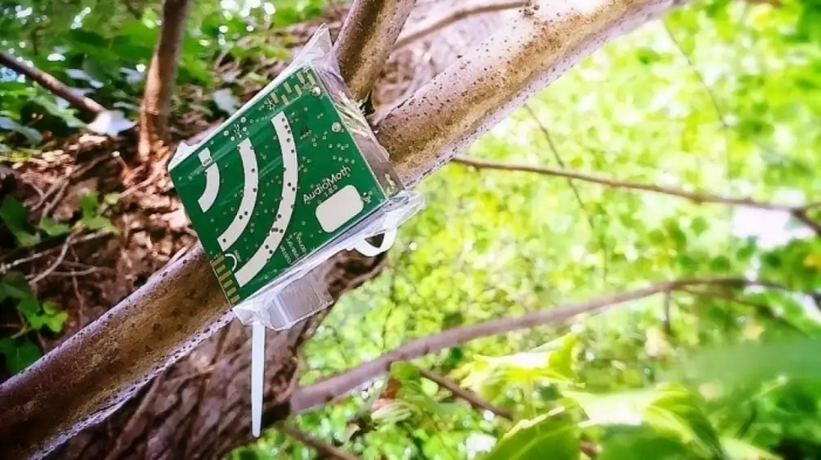
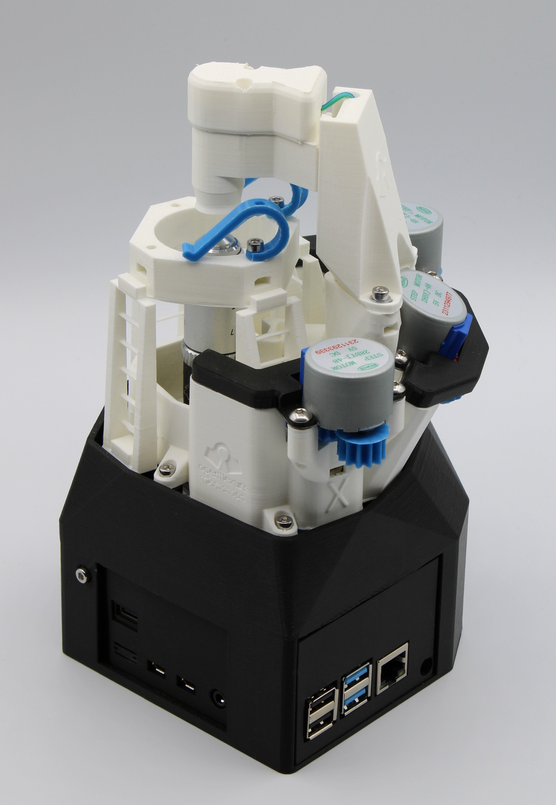

:::::::::::::::::::::::::::::::::::::: questions 

- What is open science hardware (OSH)?
- Why is OSH important in academia?
- What are examples of OSH projects?

::::::::::::::::::::::::::::::::::::::::::::::::

::::::::::::::::::::::::::::::::::::: objectives

- Define open science hardware
- Describe how OSH benefits reproducibility, access, and innovation
- List at least 3 concrete examples of OSH in research or education.

::::::::::::::::::::::::::::::::::::::::::::::::

## Background: complex challenges, open opportunities

The challenges we are facing in the 21st century call for a more democratic, collaborative, all hands on deck approach to science and technology. But to participate in research, people need tools. Ideally, tools that would allow anyone to locally pursue the research questions they are seeking to answer.

During the last decade, following the ideas of [free and open source software](https://en.wikipedia.org/wiki/Free_and_open-source_software) and seizing the opportunities opened by the [maker movement](https://en.wikipedia.org/wiki/Maker_culture), more and more people started building their own tools for research. Taking the “open” in open science one step further, they release their creations or modifications under open licenses, sharing them through different internet platforms so anyone can build, study, modify, or commercialize them.

This practice, or “open science hardware (OSH)”, is growing worldwide. 

::: callout

In their 2021 Open Science recommendation, UNESCO defines open science hardware as *"the design specifications of a physical object which are licensed in such a way that said object can be studied, modified, created and distributed by anyone, providing as many people as possible with the ability to construct, remix and share their knowledge of hardware design and function."*

:::

## Why are researchers using and developing OSH?

Today, researchers in academia have a hard time making science hardware work for their own needs. Science tools can be considered what we call black boxes: we know what goes in and what we get back, but we have limited or no information on their internal workings or design. This is a significant problem for science in terms of reproducibility, but it also has other consequences.

For scientists, black boxes are a problem because they make it difficult to source, maintain and adapt tools to different needs. Science often demands adapting experimental settings to new research questions; collaborative research with communities or citizen science projects often presents needs that were not originally conceived in the design of science hardware. The lack of access to blueprints combined with the niche, highly-specialized nature of science increases labs' dependence on centralized vendors; only some can afford the extra costs and delays.

Beyond customization, most of the tools used in research today are unevenly distributed. Science infrastructure is usually available to highly skilled experts, well-funded laboratories, and renowned institutions in countries with high investments in science and technology. For many scientists with limited budgets, access to the tools for research is hampered by prohibitive import taxes, lack of access to technical support, or inability to source spare parts. It becomes even more difficult for those communities aiming to participate in research in non-conventional settings, outside academia.

::: instructor

This section is good for learners to exchange their own experience with science

:::

## Advantages of open science hardware

In this context, developing and using OSH gives researchers much better control over their experiments, and access to research that wouldn’t be possible with conventional proprietary instrumentation.

There are several benefits of OSH, including:

1. **Research integrity:** Research is inherently iterative, where we always build on past knowledge. Making hardware designs open source for others to study, peer review, reuse, and improve demonstrates accountability and commitment to the scientific process.

2. **Replicability:** Open Source Hardware designs can be replicated, allowing for verification and reproduction of experiments and data. Moreover, users can have much better control on the calibration of their devices, boosting replicability even further.

3. **Innovation:** By making OSH designs open source, others can collaborate on the design process leading to faster development, better products, and a larger user base for OSH instruments. Everyone benefits, as new designs do not need to start from scratch and designers of original instruments get access to derivatives of their work without having to develop things themselves.

4. **Accessibility:** OSH can make research more accessible, inclusive and diverse as the availability of designs allow anyone, anywhere to replicate and use hardware to test emerging ideas, and collect data, independently from who and/or where they are.

5. **Flexibility:** OSH allows researchers to quickly put together designs to test new research questions in an accessible way. With less risk, researchers can explore a new direction before committing more resources or using shared facilities that imply greater bureaucracy. Using rapid prototyping tools and open source licences scientists can adapt their experiments to their needs, and share these changes so others can do the same.

6. **Parallelisation:** Given the general fairer price point of OSH, the same budget that allows for the purchase of one proprietary device, normally enables the purchase/building of several equivalent OSH designs. This potentially enables much faster data collection and even collection of certain types of data that would be too cumbersome to do in a serial manner.

7. **Sustainability:** OSH designs can be more sustainable than proprietary products because they can be repaired and modified, extending the lifespan of the product and reducing waste. And in the case of the supplier going out of business, users and/or third party companies can keep systems running. 

8. **Education:** OSH designs can be a valuable educational tool, allowing students and researchers to learn from it, and fully understand how a certain tool is capable of capturing data on specific phenomena/events. This in turn opens up the opportunity for the design of better experiments and better control of data being output by equipment. 

::::::::::::::::::::::::::::::::::::: callout

How does OSH align with FAIR principles?

People in the community are working towards alignment with FAIR, to make OSH:
- Findable: Projects are shared with searchable metadata on open platforms.
- Accessible: Designs are available online under open licenses—no paywalls or restrictions.
- Interoperable: Uses standard, widely accepted formats like STL or CSV, and modular designs that work well with other systems.
- Reusable: Complete documentation and clear licensing make it easy for others to build, adapt, and improve on the work.

::::::::

::: challenge 

## Challenge 1: OSH and libraries

Identify three ways in which open science hardware aligns with library values of access and preservation.

::: solution 

## Possible answers
 
**ACCESS**
- It makes science tools available to more people: Just like libraries help people access books and info for free, OSH makes lab equipment and tools available without needing to buy expensive commercial stuff.

- Helps level the playing field: A small university or school with limited funds can build tools using OSH designs, giving more people a chance to do real science.

- Encourages learning by doing: Since people can build and modify the hardware, it’s like having hands-on learning resources, which libraries often promote.

- Supports community-driven knowledge: OSH is often built and improved by communities, similar to how libraries value sharing knowledge openly.

**PRESERVATION**
- It documents everything: OSH projects usually include manuals, design files, parts lists, etc. That makes them easy to reproduce and store—just like libraries archive useful information.

- It keeps knowledge from disappearing: If a company stops making a tool, you’re stuck. But if it’s open, the design still exists and can be reused or repaired later.

- Formats and licenses make reuse easier :Like how libraries like open formats (PDF, CSV, etc.), OSH encourages using accessible formats and clear licenses, so designs can be preserved and reused easily.

- People can adapt and remix the designs: like preserving not just the object, but the idea behind it—so others can build new things from the old.

- It’s sustainable: by enabling repairs and upgrades instead of throwing things away, OSH supports long-term use and reduces waste—something libraries increasingly care about.

:::::::::::::::::::::::::::::::::
:::::::::::::;

## Examples of OSH in academia and beyond

### Neuroscience: [Open Ephys](https://open-ephys.org/)

Open Ephys is an open-source, employee-owned cooperative that aims to make neuroscience research more accessible by providing high-quality, affordable tools for electrophysiology. Founded in 2014, it supports researchers in building their own open-source rigs and promotes community ownership of scientific tools. By focusing on collaboration, open standards, and cost-effective alternatives to commercial systems, Open Ephys helps reduce duplication of effort and fosters innovation across the global neuroscience community.

## Conservation ecology: Audiomoth - [Open Acoustic Devices](https://www.openacousticdevices.info/)

AudioMoth is a low-cost, open-source audio recorder designed for environmental and biodiversity research, capable of capturing both audible and ultrasonic sounds. Originally funded by UK research councils, it has been widely used to monitor wildlife and detect illegal activities impacting ecosystems, such as tracking jaguar and puma populations. Its affordability and open design have led to broader applications, including studies on human health and noise pollution. Now developed and distributed by Open Acoustic Devices, AudioMoth can be bought pre-assembled or built using freely available design files.

## Microscopy: [OpenFlexure](http://Openflexure.org)

OpenFlexure is a high-precision, 3D-printed microscope designed to be affordable, customizable, and easy to maintain, making it ideal for education, research, and even healthcare applications. Originally developed at the University of Bath and now co-developed with STICLab in Tanzania, it combines traditional microscope objectives or a Raspberry Pi camera with submicron stage precision. Its open, modular design allows users around the world to adapt the tool for needs like water quality testing or malaria diagnosis. By relying on locally printable parts, OpenFlexure enables communities to build and repair their own scientific equipment without costly servicing.

{alt='Latest version of the OpenFlexure microscope'}

::: challenge 

## Challenge 2: Find open science hardware projects

Use a simple browser search and list the three most interesting open science hardware projects you can find online.

::: solution 

Many possible answers!

:::::::::
:::::::::

::: keypoints 

- Open science hardware (OSH) makes scientific tools freely available to study, build, and adapt—supporting transparency and innovation.
- OSH addresses the limitations of proprietary “black box” tools by promoting reproducibility, accessibility, and customization.
- It empowers researchers worldwide, especially those with limited resources, to participate in and contribute to science.
- Examples of open science hardware can be found in most academic fields, with salient examples in neuroscience, environmental monitoring and microscopy 

:::
