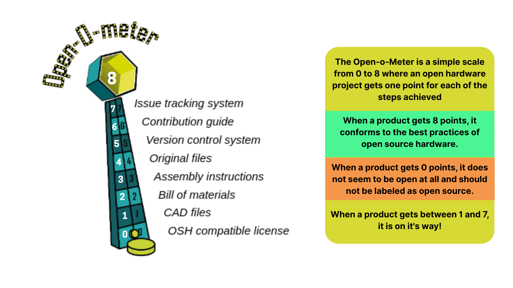

:::::::::::::::::::::::::::::::::::::: questions 

- How can librarians find open science hardware for a researcher?
- What are the most popular platforms for sharing open science hardware?
- How can librarians assess if a project follows best practices?

::::::::::::::::::::::::::::::::::::::::::::::::

::::::::::::::::::::::::::::::::::::: objectives

- Follow a step-by-step route to find candidate OSH designs for a researcher.
- Recommend platforms for finding or publishing OSH designs.
- Quickly assess a project for documentation completeness and licensing clarity.

::::::::::::::::::::::::::::::::::::::::::::::::

## A route for finding open hardware

There is no single catalogue of open science hardware. Discoverability is still weak: designs are spread across repositories, hardware platforms, journals and project websites, and many are hard to find without knowing the right name. When a researcher asks you to find a design, it helps to follow the same route each time.

1. **Clarify the need.** What does the device have to do? What measurement, sample size, budget, skills and lab space does the researcher have? A short written description makes every later search easier.
2. **Start with the OSHWA certification list.** The [OSHWA certification list](https://certification.oshwa.org/list.html) only includes projects that have documented their files and licenses, so it is a good first stop. Filter by type of hardware or by license.
3. **Search the hardware platforms and repositories.** Try the [Open Hardware Repository](https://www.ohwr.org/), [Hackaday.io](https://hackaday.io/) and [Wikifactory](https://wikifactory.com/platform/), described in the next section.
4. **Search the journals.** [HardwareX](https://www.hardware-x.com/) and the [Journal of Open Hardware](https://ojs.lib.uwo.ca/index.php/openhardware) publish peer-reviewed designs with their files, and field journals sometimes do too.
5. **Search code forges and the web.** Search GitHub or GitLab, and a general search engine, using the device name plus terms such as "open hardware", "open source" or "build instructions".
6. **Check the candidates.** Use the checks in the next sections (documentation, license, community signs) to narrow the list to a few designs, and tell the researcher what you found and what you could not verify.

Expect to repeat steps, and expect that sometimes nothing suitable exists. Saying so honestly is a useful result.

## Where do people share designs?

Open hardware designs are shared through a variety of platforms and channels, chosen depending on the project's goals and audience.
 
Online code repositories such as [GitHub](https://github.com/) and [GitLab](https://about.gitlab.com/) are among the most common spaces, offering version control, collaboration features, and easy file sharing. These repositories are the standard in software development, and will be easily accessible to some researchers but not to most of them. A good README file or website associated with the repository is necessary to ensure broad accessibility.

Some platforms like [Hackaday.io](http://Hackaday.io) or [Wikifactory](https://wikifactory.com/platform/) offer dedicated hosting for hardware designs. These are often websites where makers and scientists can showcase their work and receive feedback from peers. Specific communities, like biohacking ones, run their own Wikis. These are more accessible than repositories, but if they don’t point to them they may lack essential information (such as version control).

Academic journals also play an important role: publications such as [HardwareX](https://www.hardware-x.com/) or the [Journal of Open Hardware](https://ojs.lib.uwo.ca/index.php/openhardware) allow researchers to publish peer-reviewed articles that include design files and documentation. In recent years, traditional journals have started accepting open science hardware as part of their scope. This means that you may find [open hardware](https://doi.org/10.1364/BOE.385729) designs for microscopy in journals such as [Biomedical Optics Express](https://opg.optica.org/boe/).

In addition, some institutions maintain their own open access repositories, where staff and students can deposit hardware designs alongside datasets or publications. The [Open Hardware Repository (OHR)](https://www.ohwr.org/) at CERN is an early example of a platform where engineers and scientists share designs for scientific instruments under open licenses, making it a valuable resource for librarians seeking high-quality, peer-tested hardware documentation.

::: callout
A good OSH repository makes it easy for people to upload their designs, and for others to find, understand, replicate, and contribute to the projects in it.

:::

## Checking for a good design
When assessing whether an open hardware project follows best practices, librarians can guide researchers by focusing on a few essential elements. The first and most critical is documentation. 

A good open science hardware (OSH) project should include all the necessary files—such as design schematics, bills of materials (BOM), assembly instructions, and source code where relevant. This documentation should be clear, complete, and accessible to users who are not part of the original development team. Without it, the project may be difficult or impossible to reproduce.

Another key element is licensing. A project is not truly open unless it is accompanied by a recognized open license, such as the CERN Open Hardware Licence (OHL). This license ensures that users are legally permitted to reuse, adapt, and redistribute the design. Clear licensing also builds trust and signals a commitment to openness and collaboration.

Importantly, librarians should also consider the development stage of the design. Is the project an early-stage prototype, a more stable demonstrator, or a market-ready product? This distinction affects how usable the project is in practice. 

A prototype may offer valuable insights but might not yet be fully documented or reproducible. A product-level design, on the other hand, should be well-tested, standardized, and ready for others to adopt with minimal modifications. Recognizing where a project sits along this spectrum helps manage expectations and guides the kind of support or caution librarians might offer to researchers exploring reuse.

::: callout
Academics often reuse, develop and publish open hardware prototypes. This is because most use open science hardware to test new ideas, and appreciate the flexibility it provides. On the other hand, researchers can also be final users of open science hardware. In this case, they may not be interested in development, but looking for final products that ensure they are safe and reliable enough to generate good data.
:::

Finally, signs of community engagement—such as active GitHub issues, user feedback, or visible updates—can indicate that a project is maintained and evolving. Evidence of testing or calibration data further strengthens confidence in the hardware’s reliability. And, as with any research tool, accessibility matters: designs that rely on widely available and affordable components are more likely to be usable across diverse settings. By combining these criteria, librarians can help researchers identify open hardware projects that are not only open in theory but truly usable in practice.

::: challenge 

## Challenge 1: Following the route

A researcher in your institution asks: "Is there an open source design for a low-cost sensor or instrument I could build for my project?" Pick a plausible instrument from a field you know (for example a data logger, a pipette, a microscope stage or a water-quality sensor) and follow the route above for about 10 minutes.

Write down where you looked, which steps gave results, and which candidate designs you would take forward. Then pick one platform you used and assess it: would a typical researcher at your institution be able to understand, access and reuse projects hosted there?

::: solution

## What to expect

- Most people find the OSHWA list and the journals the quickest route to well-documented designs, and code forges give the most results but the most variable quality.
- A good write-up names the candidates, links to each, and says which checks (documentation, license, community activity) each one passes.
- It is a valid outcome to find no suitable design, or only partly documented ones. Say so and suggest next steps, such as asking the project's authors or searching with different terms.
- Platform assessments will differ. Repositories such as GitHub need some familiarity with version control, while hardware platforms and journal articles are usually easier for non-experts to read.

:::
:::::::::

## Questions to ask before sharing

In addition to knowing where to find and evaluate open science hardware (OSH) projects, librarians can play a proactive role in helping researchers prepare their own designs for sharing. Before choosing a platform or writing documentation, researchers benefit from structured reflection on what they are sharing, why, and for whom. 

Librarians can support this process by asking a few targeted questions that clarify the project’s goals and readiness. For example: Is the hardware functional and tested? Is the documentation complete and understandable to someone outside the lab? Does the researcher want community contributions, visibility, citations, or potential commercial uptake?

These early conversations can also surface issues that may otherwise go unnoticed, such as gaps in attribution, unclear licensing, or ethical concerns related to safety or misuse. For instance, a researcher may be unsure whether their design is eligible for open licensing, or may want to restrict certain uses without knowing how to reflect that in a license. Others may be unclear about whether internal documentation (lab notes, partial prototypes) should be included. 

Readiness conversations are an opportunity to align expectations and introduce best practices from the start. If a researcher wants their design to be used by others, then thinking early about documentation structure, file formats, and accessibility will save effort down the line.

Basic recommendations such as using plain-language README files, ensuring bill of materials are clearly sourced, and publishing in open, editable formats can be helpful early on a project. Beyond discovery and curation of open science hardware, librarians can help researchers make their work not just open, but useful, transparent, and inclusive.

::: callout

### Why share early?
Even early-stage documentation can help others avoid duplication, learn from failure, and co-develop ideas. Encourage researchers to publish their process, not just results.

:::

::: challenge 

## Challenge 2: Guiding compass

Based on the “Questions to ask before sharing” section, create a short guide or template with 4–6 key questions you could use when consulting with a researcher who wants to share an open hardware project. Your goal is to help them clarify their objectives, check for documentation completeness, and ensure their licensing approach matches their intentions.

::: solution 

## Possible answers

- What is your goal in sharing this project?
- Who is your intended audience or user group?
- Is your documentation complete and easy to follow?
- Have you chosen an open license?
- Where will you publish or host the project?
- Are there any risks or responsibilities others should be aware of?

:::
::::::::::::::

::: keypoints 

- There is no single catalogue of OSH. A repeatable search route (clarify the need, OSHWA list, platforms, journals, code forges, then check the candidates) helps librarians find designs, and sometimes the honest answer is that none exist.
- OSH projects are shared on a range of platforms—GitHub, GitLab, Hackaday.io, Wikifactory, academic journals, and institutional repositories—all with different strengthts
- A well-documented OSH project should include at least: A README file,  design files in open formats, bill of materials (BOM), assembly/testing instructions, open licensing
- Visible community engagement (e.g. GitHub issues, forum interactions, feedback) is a strong signal of project health and usability.
- Even early-stage sharing—of ideas, trade-offs, and decisions—can foster transparency, collaboration, and reuse.

:::
