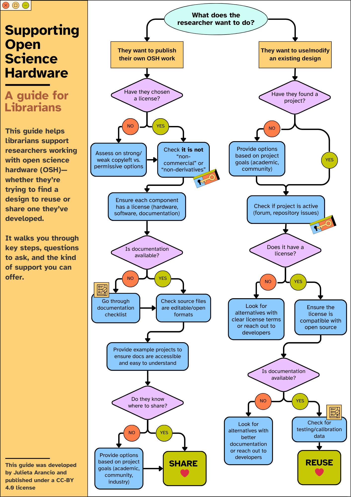

{alt="Flowchart titled Supporting Open Science Hardware: A guide for librarians. It starts with the question 'What does the researcher want to do?' and splits into two paths, one for publishing their own OSH work that ends in Share, and one for using or modifying an existing design that ends in Reuse. The full text of each path is given below the image."}

This guide helps librarians support researchers working with open science hardware (OSH), whether they're trying to find a design to reuse or share one they've developed. It walks you through key steps, questions to ask, and the kind of support you can offer.

## Text version of the flowchart

The flowchart starts with one question: **What does the researcher want to do?** It then splits into two paths.

### Path 1: They want to publish their own OSH work

1. **Have they chosen a license?**
   - If no: assess strong copyleft, weak copyleft and permissive options with them, then continue to the next step.
   - If yes, or once one is chosen: check that it is **not** a "non-commercial" or "non-derivatives" license.
2. Ensure each component has a license (hardware, software, documentation).
3. **Is documentation available?**
   - If no: go through the documentation checklist, then continue to the next step.
   - If yes, or once it exists: check that the source files are in editable, open formats.
4. Provide example projects to make sure the documentation is accessible and easy to understand.
5. **Do they know where to share?**
   - If no: provide options based on the project's goals (academic, community, industry), then share.
   - If yes: **Share**.

### Path 2: They want to use or modify an existing design

1. **Have they found a project?**
   - If no: provide options based on project goals (academic, community), then continue to the next step.
   - If yes: continue to the next step.
2. Check whether the project is active (forum, repository issues).
3. **Does it have a license?**
   - If no: look for alternatives with clear license terms, or reach out to the developers.
   - If yes: ensure the license is compatible with open source, then continue to the next step.
4. **Is documentation available?**
   - If no: look for alternatives with better documentation, or reach out to the developers.
   - If yes: check for testing and calibration data, then **Reuse**.

This guide was developed by Julieta Arancio and is published under a CC-BY 4.0 license.
